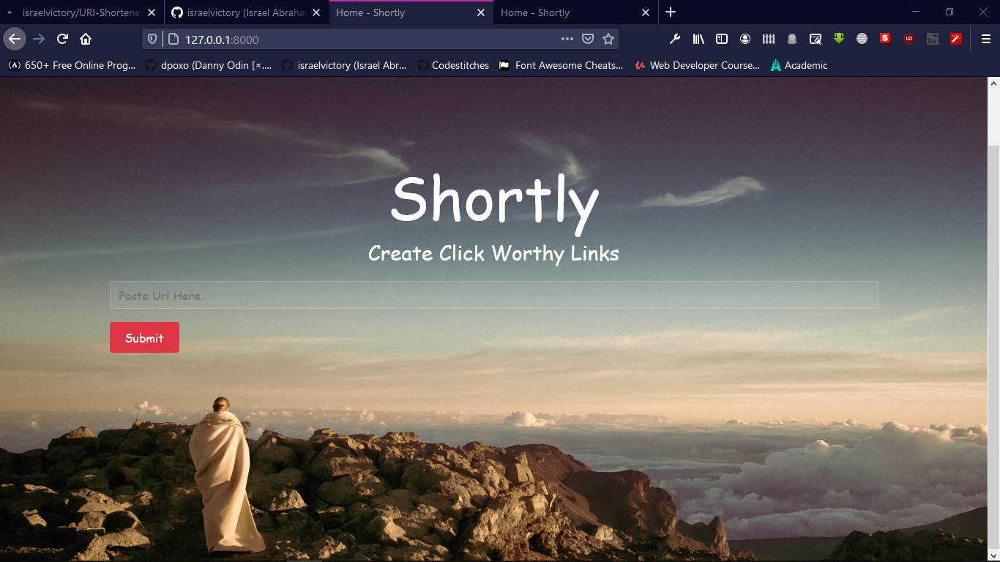

# Django-URI-Shortener

This is a URL shortening application built using Django.
It began as a Project idea on RealPython.com and has been fully implemented by me.🙂

# User Interface



# Features

- Keeps count of how many time each URL is followed.
- Random and String Modules implemented to generate the token for the original URL.
- URL Length: Shortened URL are combination of numbers(0-9) and characters(a-Z) of length 5.
- A 404 page.
- A Stats page.

To get it running on your local machine, follow the steps below:

1. Run the commands below in your terminal:

```
git clone https://github.com/israelvictory/URI-Shortener.git
```

2. Change directory to diary:

```
cd URI-Shortener/shortly
```

3. Install the requirements with the command below:

```
pipenv install -r requirements.txt
```

4. Run the development server with

```
python manage.py runserver
```

5. Launch your browser and navigate to:

```
http://127.0.0.1:8000
```
